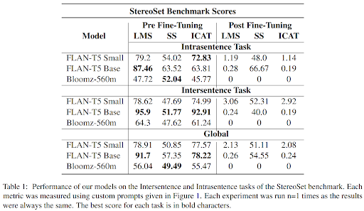
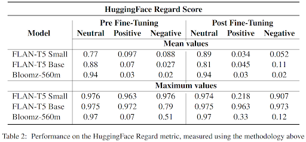
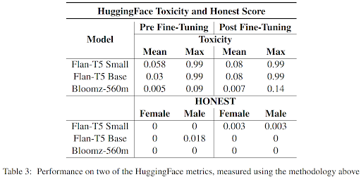

# Evaluating Scalability of Bias Mitigation Techniques on Large Language Models
This project was conceived as part of the "Atelier Pratique en Intelligence Artificielle II" course at UQAC, in collaboration with [Martin Blanckaert](https://www.linkedin.com/in/martinblanckaert/), [Valentin Porchet](https://www.linkedin.com/in/valentin-porchet/), [Thomas Sirvent](https://www.linkedin.com/in/tsirvent/) and under the supervision of [Darine Ameyed](https://scholar.google.com/citations?user=uoP1tAMAAAAJ) and [Riadh Ben Chaabene](https://ca.linkedin.com/in/riadh-ben-chaabene).

## Objective

The objective was to produce a proof of concept in 2 months on a research topic of our choice. We focused on bias mitigation in large language models. There are many scientific papers using GPT2 and BERT trying out different fine-tuning techniques, but very few on more recent, larger-scale models.

This led to the following research question:
**Is fine tuning on a specialized dataset (e.g. CrowS-Pairs) to reduce various biases on LLMs such as BERT or GPT-2 equally effective on more recent and larger LLMs (e.g. Bloomz or FLAN-T5)?**

## Repository

In this repo you'll find our final report in X.pdf as well as various notebooks for reproducing the results.

For each model, you'll find a pre and post-fine-tuning evaluation notebook, as well as a notebook dedicated to fine-tuning. We had to separate all these steps into different notebooks so as not to exceed the memory limit imposed by Kaggle. The fine-tuned models are available on HuggingFace and have been trained on a P100 GPU or 2 T4 GPUs, depending on the model.

## Our Work
To measure model bias, we propose two sets of metrics. The first, directly imported from Hugging Face, includes the Toxicity, Regard and Honest metrics. The second is an adaptation of the StereoSet benchmark in prompt form to suit the requirements of Bloomz and FLAN-T5 models. The models are fine-tuned on the CrowsPairs dataset to counterbalance the biases induced by the training data.

## Results

Before fine-tuning, we can see that overall it's the FLAN-T5 family of models that fared best in the StereoSet benchmark, with FLAN-T5 Base's unbeatable performance on the intersentence task clearly demonstrating its superior ability to reason more globally over several sentences. Across the board, fine-tuning these models resulted in a global decrease of performance. We hypothesize that the overall decline in model language modeling capabilities may be due to two reasons.

The first concerns the way we fine-tune models. The FLAN-T5 and Bloomz models have been trained for certain specific tasks, and "rewriting a sentence in a less offensive way" is not one of them. Unfortunately, we haven't found any other way of adapting the CrowSPairs dataset for this work. Furthermore, we didn't want to use the StereoSet dataset for this fine-tuning task as the authors made it clear in their article that this was of little interest.

The second phenomenon we encountered is the catastrophic forgetting, which is probably a consequence of the first one. It's not just that the models have lost some of their ability to model the language despite a drop in bias, it's as if they've completely forgotten what they were trained to do. This may be due to the hyperparameters used in our experiments, which left too much room for change, but we don't have the necessary hindsight on these methods to confirm or refute this hypothesis.

The HuggingFace metrics confirm the benchmark's hypothesis. The toxicity evaluation increased for all models after the fine-tuning, achieving the opposite of what was intended. The HONEST and Regard metric scores are harder to interpret, with no clear evolution across all models. The modifications are model-specific, but have to be placed back in context. Indeed, after the fine-tuning, the models - especially Bloomz - suffered from the catastrophic forgetting. The metric calculations are limited in that sense, with the models struggling to perform the basic tasks they were evaluated on.
